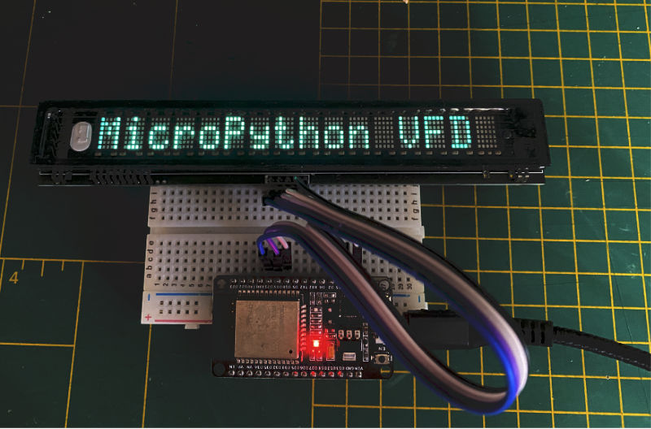
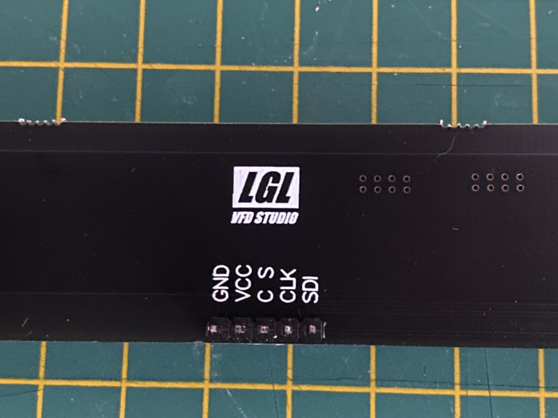

# MicroPython VFD driver

>Micropython driver for the 8-MD-06INKM Futaba VFD display with 16 segments

## Vacuum fluorescent display (VFD)

Futaba Vacuum fluorescent display are very bright displays and together with
a LGL VFD Studio backplate, very easy to control using SPI.
Including power, only five connections are needed (GND, VSS, CS, CLK and SDI/MOSI).




## Install

1) Copy the file [`vfd_16.py`](vfd_16.py) to your microcontroller.

2) Connect the five pins as follows:




| VFD | ESP32   |
|-----|---------|
| GND | GND     |
| VCC | 3V3     |
| C S | GPIO 18 |
| CLK | GPIO 19 |
| SDI | GPIO 21 |

To connect the VFD to a breadboard, you need to solder a 5 pin header to the VFD display first.

3) Then use this code to show some text on the display:

```python
import vfd_16

display = vfd_16.Display(cs=18, clk=19, sdi=21, dimming=100)

display.write('12345678abcdEFGH')
```

With an ESP32, you can use any free GPIO pins. On other microcontrollers, you might want to
connect the VFD pins to the corresponding SPI pins on the microcontroller.
In that case, connect the VFD SDI pin to the microcontroller MOSI pin.

## API

### `display = vfd_16.Display(cs=18, clk=19, sdi=21, dimming=100, baudrate=20000000)`

Initialise the display.

| Parameter |          |                 |
|-----------|----------|-----------------|
| `cs`        |          | GPIO pin number |
| `clk`       |          | GPIO pin number |
| `sdi`       |          | GPIO pin number |
| `dimming`   | Optional | Dimming (0-240) |
| `baudrate`  | Optional | SPI Baudrate    |

### `display.write('12345678ABCDEFGH')`

Write a string of up to 16 characters to the display.

### `display.write('XYZ', position=6)`

Write a string at the specified position.

### `display.light_off()`

Turn the lights off.

### `display.light_on()`

Turn the lights on. In combination with `light_off()`, this can be used to blink text.

### `display.stand_by_mode()`

Put the display in standby mode to conserve energy. The display will be off.

### `display.normal_mode()`

Get the display out of standby mode.

### `display.dim(120)`

Dim the display. Values go from 0 (dark) until 240 (full brightness).

### `display.clear()`

Clears the display from any text.

## Hardware

This code is tested with an ESP32 microcontroller, but should work with other microcontrollers that can run Micropython as well.
Let me know your experiences, so I can update this documentation.

## Where to buy?

There are several places where you can buy this VFD display. For example:

[Ali Express/Hi IE Store](https://www.aliexpress.com/item/1005001498957894.html)

When buying the display, make sure that:
- It has 16 segments (digits)
- It has only one row of text
- It has a backplate PCB with five connections (GND, VSS, CS, CLK and SDI).

It should look just like the photos in this document.

## What about 8 segment displays?

This driver is for the 16 segment (digits) VFD display only.
If you have a 8 segment display, I recommend to take a look at
[MicroPython 8MD-06INKM display driver](https://github.com/Reboot93/MicroPython-8MD-06INKM-display-driver) from Reboot93.

## Specification

The specification below applies to the 8 segment version. Most of the API is similar, though.

[Futaba 8-MD-06INKM specification](https://davll.me/posts/2021/05/22/futaba-vfd-1/data/008MD006INKM_A.pdf)

## License

Copyright 2022 [Edwin Martin](https://bitstorm.org/) and released under the [MIT license](LICENSE).
